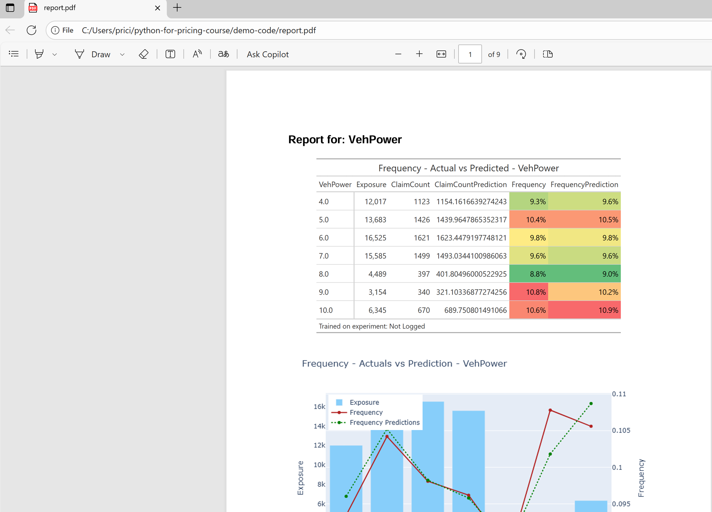

# 4.3. PDFs


```python
from reportlab.platypus import SimpleDocTemplate, Image, Spacer, Paragraph, PageBreak, KeepTogether
from reportlab.lib.pagesizes import letter
from reportlab.lib.styles import getSampleStyleSheet
import io
import tempfile
import os
from PIL import Image as PILImage

# Page and margin configuration
PAGE_WIDTH, PAGE_HEIGHT = letter
TOP_MARGIN = 72
BOTTOM_MARGIN = 72
LEFT_MARGIN = 72
RIGHT_MARGIN = 72
AVAILABLE_HEIGHT = PAGE_HEIGHT - TOP_MARGIN - BOTTOM_MARGIN

# --- Helper: Save GT table to PNG in memory (Windows-safe) ---
def render_gt_table_as_image(gt_obj, scale=2.0):
    tmp_path = tempfile.mktemp(suffix=".png")
    try:
        gt_obj.save(tmp_path, scale=scale)
        with open(tmp_path, "rb") as f:
            buf = io.BytesIO(f.read())
        buf.seek(0)
    finally:
        if os.path.exists(tmp_path):
            os.remove(tmp_path)
    return buf

# --- Helper: Scale images proportionally ---
def get_scaled_image(buf, max_width, max_height):
    buf.seek(0)
    pil_img = PILImage.open(buf)
    orig_width, orig_height = pil_img.size

    scale = min(max_width / orig_width, max_height / orig_height)
    new_width = orig_width * scale
    new_height = orig_height * scale

    buf.seek(0)
    return Image(buf, width=new_width, height=new_height)

def generate_pdf_report(features, output_file="report.pdf"):
    doc = SimpleDocTemplate(
        output_file, pagesize=letter,
        topMargin=TOP_MARGIN, bottomMargin=BOTTOM_MARGIN,
        leftMargin=LEFT_MARGIN, rightMargin=RIGHT_MARGIN
    )
    elements = []
    styles = getSampleStyleSheet()

    image_max_width = PAGE_WIDTH - LEFT_MARGIN - RIGHT_MARGIN
    chart_max_height = AVAILABLE_HEIGHT * 0.6
    table_max_height = AVAILABLE_HEIGHT * 0.35  # small buffer

    for i, feature in enumerate(features):
        # --- Plotly chart ---
        aggregated_data = aggregate_frequency_df(holdout, feature, continous_feature_config)
        fig_chart = plot_aggregated_data(
            visual_data=aggregated_data,
            feature=feature,
            target='Frequency',
            prediction='FrequencyPrediction',
            exposure='Exposure'
        )
        buf_chart = io.BytesIO()
        fig_chart.write_image(buf_chart, format="png")
        buf_chart.seek(0)
        img_chart = get_scaled_image(buf_chart, max_width=image_max_width, max_height=chart_max_height)

        # --- GT table ---
        gt_table = create_frequency_table(aggregated_data, feature=feature)
        buf_table = render_gt_table_as_image(gt_table, scale=2.0)
        img_table = get_scaled_image(buf_table, max_width=image_max_width, max_height=table_max_height)

        # --- Heading + table together (small, safe) ---
        elements.append(KeepTogether([
            Paragraph(f"Report for: {feature}", styles['Heading2']),
            Spacer(1, 6),
            img_table,
            Spacer(1, 6)
        ]))

        # --- Chart separately ---
        elements.append(img_chart)
        elements.append(Spacer(1, 6))

        # Page break after each feature except the last one
        if i < len(features) - 1:
            elements.append(PageBreak())

    doc.build(elements)
    print(f"PDF report saved to {output_file}")
```


