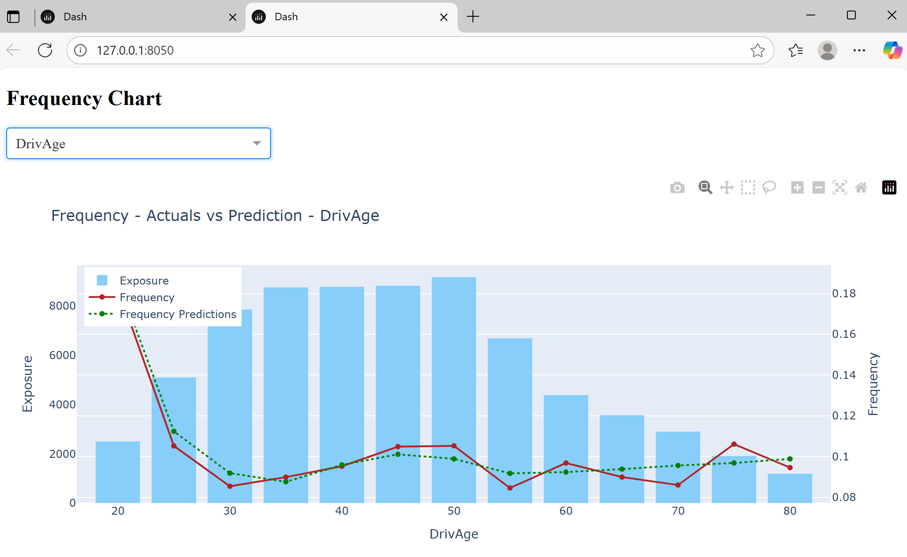

# 4.4. Dashboards / Apps

So far, we’ve seen how to turn aggregated data into tables and charts. That already gives you reproducible outputs that can be paired with modelling or pricing deployments. But for day-to-day analysis, a static chart often isn’t enough — an interactive dashboard can make results far easier to explore and share.  

---

## Dashboard Software

Tools like [Power BI](https://www.microsoft.com/en-us/power-platform/products/power-bi) and [Tableau](https://www.tableau.com/en-gb) are widely used in pricing teams. They are quick to set up and great for building simple front ends over aggregated data.  

The trade-off is that they often become separate projects in themselves: business logic gets duplicated outside of your codebase, dashboards overlap with one another, and version control is difficult. This makes them harder to maintain over time.  

---

## Python Dashboard Libraries

Building dashboards directly in Python avoids much of this duplication. You can:

- Reuse the same functions you’ve already written for analysis.  
- Keep your dashboards under version control alongside your code.  
- Build multiple dashboards from the same logic with very little extra work.  

The most widely used Python framework for this is [Plotly Dash](https://dash.plotly.com/). Dash apps are powered by the same Plotly charts we’ve already created, but wrapped in a simple web interface. Stakeholders can open them in a browser and interact directly — changing drop-downs, zooming into plots, or exploring different features — without ever touching Python.  

In insurance pricing, dashboards are particularly useful for:

- Comparing model performance across features or segments.  
- Letting underwriters and managers explore results without needing Python or SQL.  
- Replacing ad-hoc Excel pivot tables with a single interactive view.  

Examples of Dash apps can be found [here](https://plotly.com/examples/).  

---

## Example: Interactive Frequency Chart

Below is a basic Dash app with a dropdown to select a feature and an interactive chart. Save the code below into a file called `app.py`:

## Plotly Dash

```python
import json
import polars as pl
from dash import Dash, dcc, html, Input, Output
from utils.visual_utils import aggregate_frequency_df, plot_aggregated_data

# === Load data and config ===
holdout = pl.read_parquet('./demo-code/processed-data/holdout_frequency_predictions.parquet')

with open('./demo-code/config/frequency_config.json', 'r') as f:
    frequency_config = json.load(f)

with open('./demo-code/config/continuous_feature_visuals.json', 'r') as f:
    continuous_feature_config = json.load(f)

features = frequency_config['features']

# === Dash App ===
app = Dash(__name__)

app.layout = html.Div([
    html.H2("Frequency Chart"),
    
    # Dropdown
    dcc.Dropdown(
        id="feature-dropdown",
        options=[{"label": f, "value": f} for f in features],
        value=features[0],
        clearable=False,
        style={"width": "300px", "margin-bottom": "20px"}
    ),

    # Graph
    dcc.Graph(id="frequency-chart")
])

# === Callback ===
@app.callback(
    Output("frequency-chart", "figure"),
    Input("feature-dropdown", "value"),
)
def update_chart(feature):
    agg_df = aggregate_frequency_df(
        holdout,
        feature=feature,
        continuous_feature_config=continuous_feature_config
    )
    fig = plot_aggregated_data(
        agg_df,
        feature=feature,
        target="Frequency",
        prediction="FrequencyPrediction",
        exposure="Exposure"
    )
    return fig

if __name__ == "__main__":
    app.run(debug=True)
```

This app can then be run locally with the following terminal command:

```bash
python app.py
```

This gives a link to view:




