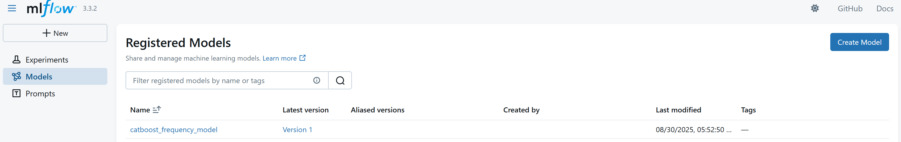
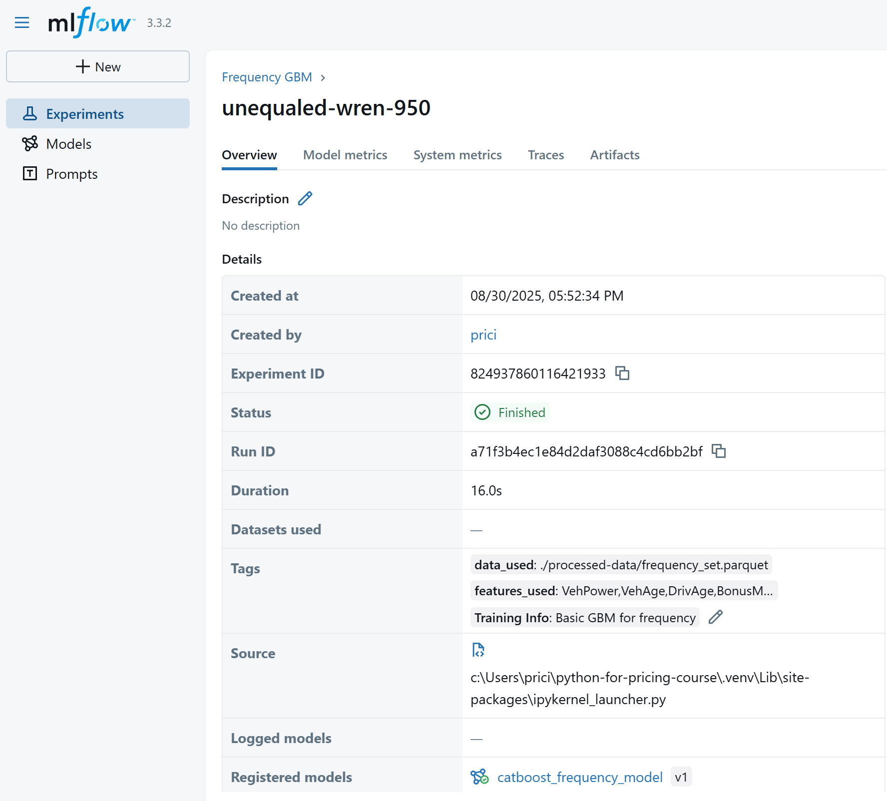
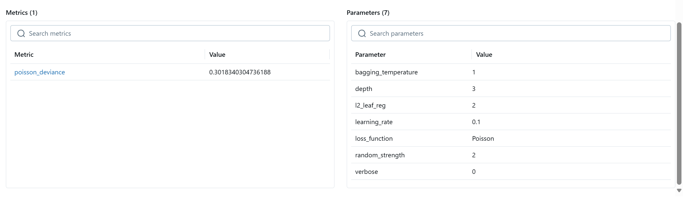

# 5.2. Training & Validation

Training and validation pipelines are the backbone of model development.  

The goal is to make training repeatable, configurable, and transparent, so that multiple analysts can run models consistently without rewriting code each time.

---

## Abstract Training Pipelines & Config Files

Most training and validation logic can be written once and reused.  
Instead of hardcoding settings into scripts, store them in configuration files (e.g. YAML, JSON).  

Configuration might include:  
- Target (response variable)  
- Exposure/offset (if relevant, e.g. earned premium)  
- Weighting (e.g. per-policy weights)  
- Feature list  
- Loss function  
- Hyperparameters  

This approach ensures:  
- Consistency across models  
- Flexibility to test variations quickly  
- Clear documentation of what was run  

```json
{
    "target": "ClaimCount",
    "exposure": "Exposure",
    "features": [
        "VehPower",
        "VehAge",
        "DrivAge",
        "BonusMalus",
        "VehBrand",
        "VehGas",
        "Area",
        "Density",
        "Region"
    ],
    "split": {
        "field": "Group",
        "assignment": {
            "1": "Train",
            "2": "Train",
            "3": "Train",
            "4": "Test",
            "5": "Holdout"
        }
    },
    "gbm_params": {
        "learning_params": {
            "loss_function": "Poisson",
            "learning_rate": 0.1,
            "depth": 3,
            "l2_leaf_reg": 2,
            "random_strength": 2,
            "bagging_temperature": 1,
            "verbose": 0
        },
        "num_rounds": 10000,
        "early_stopping_rounds": 10
    }
}
```

Which can be read in as so:

```python
with open('./config/frequency_config.json', 'r') as f:
    config = json.load(f)
```

---

## Gradient Boosting Machines (GBMs)

GBMs are generally the best performing model for tabular data, are very easy to setup, and plenty of other tools interact well with the most popular GBM libraries. These include:

- XGBoost – Originally very popular, requires numeric input, and categorical features to be one-hot-encoded.
- LightGBM – Requires numeric input, categorical features can be string-indexed.
- CatBoost – Strong performance without tuning, handles string categories natively.
 
Given CatBoost doesn't require preprocessing of categorical features, and has strong out-of-box performance without hyperparameter tuning, the modelling pipelines are simpler, which often means it's the preferred option.

```python
params = config.get('gbm_params').get('learning_params')
num_round = config.get('gbm_params').get('num_rounds')
early_stopping_rounds = config.get('gbm_params').get('early_stopping_rounds')

FrequencyModel = CatBoostRegressor(**params)
FrequencyModel.fit(train_pool, eval_set=[test_pool], early_stopping_rounds=early_stopping_rounds)
```

---

## Plots & Validation

Validation is not just about metrics — it’s about understanding the model's behaviour. 

Unlike GLM's where each feature is inspected and fitted manually, GBMs fit each feature automatically, and so reviewing the fit of each feature is important.

Modules should be created in your repository for creating these plots automatically for every model run. 

Common validation plots:  
- Feature Importance / SHAP – explainability, showing which factors matter most.  
- Partial Dependence / SHAP dependence plots – how factors influence predictions.  
- Calibration plots – compare predicted vs. actual outcomes (critical for pricing).  
- Residual plots – highlight systematic biases.  
- Lift/Gain charts – for classification tasks like conversion.  

These can be generated as a PDF report that can be reviewed before pushing a model to production.

---

## Metrics

Different types of models require different evaluation metrics.  

| Problem Type | Common Metrics | Insurance Relevance |
|--------------|----------------|---------------------|
| Binary Classification (e.g. conversion, cancellation) | ROC-AUC, Log-loss, Lift/Gain, Precision/Recall | Assess ability to rank risks and select profitable business |
| Multiclass Classification (e.g. product selection, competitor choice) | Accuracy, Cross-Entropy, Macro/Micro AUC | Evaluate across multiple outcomes |
| Regression (Continuous Response) | RMSE, MAE, R² | Predicting claim costs, severity |
| Poisson Regression (e.g. claim counts) | Deviance, AIC/BIC, Gini for ranking | Standard in frequency modelling |
| Gamma Regression (e.g. claim severity) | Deviance, RMSE, Calibration plots | Standard in severity modelling |
| Combined GLM/GBM Models | Gini, Lift, Calibration, Profit Curves | Align with pricing/business KPIs |

---

## Experiment Tracking

Experiment tracking means logging every model run with its:  
- Dataset version  
- Feature list  
- Parameters & hyperparameters  
- Metrics  
- Plots & diagnostics  

This enables:  
- Full reproducibility  
- Easy comparison across models  
- Governance/audit trail for model approval  

This is a major gap in most pricing teams, where models are often trained ad-hoc and not easily traceable.  

## Model Metadata

Each model should carry metadata about:  
- Which features were used  
- Which dataset version was trained on  
- Dependencies on other models (e.g. conversion model referencing competitor models)  
- Date trained
- Software/library versions  

All of these can be retrieved in other stages of the modelling pipelines or other processes. This makes it easy to productionise and use the outputs of the models through:

- Ensuring that when scoring, the required features are known 
- Supports model chaining (e.g. competitor into conversion) ensuring the correct predictions are fed into the next model. 
- When an experiment has better metrics than the current live model, it can be programatically promoted to live.

---

## MLFlow

MLFlow is another open source tool that allows easy experiment tracking.

Installed with uv add mlflow

It can be used locally, experiment data is stored within the repository, but this can be hosted as a SQL database or a server, and is also possible to host with Databricks.

An example of tracking an experiment is below. This is based off the quickstart guide in the MLFlow documentation and is run after the model is trained. There is also the option of autologging experiments as models are trained.

This code tracks:

- Model parameters
- Poisson Deviance
- Features used
- Data used

The signature gives us the expected input to the model. 

```python

# For using MLFlow locally, we'll use local host as the tracking uri. 
mlflow.set_tracking_uri(uri="http://127.0.0.1:8080")

mlflow.set_experiment("Frequency GBM")

# Start an MLflow run
with mlflow.start_run():
  # Log the hyperparameters
  mlflow.log_params(params)

  # Log the loss metric
  mlflow.log_metric("poisson_deviance", poisson_dev)

  # Set tags for information about the run
  mlflow.set_tag("Training Info", "Basic GBM for frequency")
  mlflow.set_tag("features_used", ",".join(features))
  mlflow.set_tag("data_used", data_path)

  # Infer the model signature
  signature = infer_signature(X_holdout, predictions)

  # Log the model
  model_info = mlflow.catboost.log_model(
      cb_model=FrequencyModel,
      name="catboost_frequency_model",
      signature=signature,
      input_example=X_holdout,
      registered_model_name="catboost_frequency_model",
  )

```

Tags can also be added afterwards, to track any other relavant information such as decisions made when training the model, changes from previous runs, etc.

```python
from mlflow.tracking import MlflowClient

client = MlflowClient()
run_id = "<your_run_id>"  # get this from the MLflow UI

decision = f"Added in new Area feature"
client.set_tag(run_id, "comments", comment)
```

Launch the MLFlow UI by running the below in the terminal

```terminal
mlflow server --host 127.0.0.1 --port 8080
```

In here we can see all the registered models:



For each experiment, the metadata:



The experiment's parameters and metrics:



