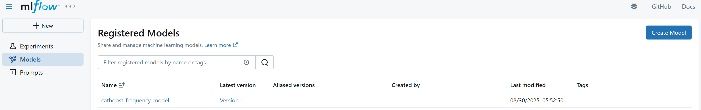
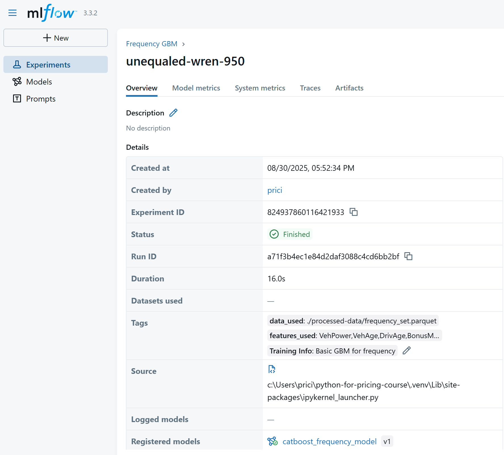

# 5.3. Model Registries

Model registries are centralised repositories that allow teams to store, version, and manage machine learning models throughout their lifecycle. Using a model registry ensures that models are traceable, auditable, and reproducible, which is critical in insurance pricing where models directly impact financial decisions.

---

## Why Use a Model Registry?

Model registries provide several benefits:

- Version Control – Every model version is tracked, so you can reproduce results from any point in time
- Lifecycle Management – Manage stages like 'Staging', 'Production', 'Archived' to control which models are actively used  
- Auditability & Governance – Maintain a full history of who created or approved a model and when
- Collaboration – Teams can share models easily without confusion over which version is current 
- Integration – Models can be pulled directly into scoring pipelines or deployed APIs reliably

In pricing teams, this prevents key-man risk, ensures regulatory compliance, and allows smooth transitions between analysts or teams.

---

## Experiment Tracking

Experiment tracking means logging every model run with its:  
- Dataset version  
- Feature list  
- Parameters & hyperparameters  
- Metrics  
- Plots & diagnostics  

This enables:  
- Full reproducibility  
- Easy comparison across models  
- Governance/audit trail for model approval  

This is a major gap in most pricing teams, where models are often trained ad-hoc and not easily traceable.  

## Model Metadata

Each model should carry metadata about:  
- Which features were used  
- Which dataset version was trained on  
- Dependencies on other models (e.g. conversion model referencing competitor models)  
- Date trained
- Software/library versions  

All of these can be retrieved in other stages of the modelling pipelines or other processes. This makes it easy to productionise and use the outputs of the models through:

- Ensuring that when scoring, the required features are known 
- Supports model chaining (e.g. competitor into conversion) ensuring the correct predictions are fed into the next model. 
- When an experiment has better metrics than the current live model, it can be programatically promoted to live.

---

## MLFlow

[MLFlow](https://mlflow.org/) is another open source tool that allows easy experiment tracking.

Installed with 'uv add mlflow'

It can be used locally, however it is preferable to host as a SQL database, server or on Databricks as this allows multiple analysts to use the same, keeping the repository for just code.

An example of tracking an experiment is below. This is based off the quickstart guide in the MLFlow documentation and is run after the model is trained. There is also the option of autologging experiments as models are trained.

This code tracks:

- Model parameters
- Poisson Deviance
- Features used
- Data used

The signature gives us the expected input to the model. 

```python

# For using MLFlow locally, we'll use local host as the tracking uri. 
mlflow.set_tracking_uri(uri="http://127.0.0.1:8080")

mlflow.set_experiment("Frequency GBM")

# Start an MLflow run
with mlflow.start_run():
  # Log the hyperparameters
  mlflow.log_params(params)

  # Log the loss metric
  mlflow.log_metric("poisson_deviance", poisson_dev)

  # Set tags for information about the run
  mlflow.set_tag("Training Info", "Basic GBM for frequency")
  mlflow.set_tag("features_used", ",".join(features))
  mlflow.set_tag("data_used", data_path)

  # Infer the model signature
  signature = infer_signature(X_holdout, predictions)

  # Log the model
  model_info = mlflow.catboost.log_model(
      cb_model=FrequencyModel,
      name="catboost_frequency_model",
      signature=signature,
      input_example=X_holdout,
      registered_model_name="catboost_frequency_model",
  )

```

Tags can also be added afterwards, to track any other relavant information such as decisions made when training the model, changes from previous runs, etc.

```python
from mlflow.tracking import MlflowClient

client = MlflowClient()
run_id = "<your_run_id>"  # get this from the MLflow UI

decision = f"Added in new Area feature"
client.set_tag(run_id, "comments", comment)
```

Launch the MLFlow UI by running the below in the terminal

```terminal
mlflow server --host 127.0.0.1 --port 8080
```

In here we can see all the registered models:



For each experiment, the metadata:



The experiment's parameters and metrics:


## Accessing models in the registry

Once a model has been registered, it can be accessed in two ways:

Through the MLflow UI – useful for browsing experiments, reviewing metrics, and manually comparing runs.

Programmatically – the normal approach when integrating a model into a pricing pipeline or application.

For example, to load the latest version of a registered CatBoost frequency model:

```python
import mlflow

mlflow.set_tracking_uri(uri="http://127.0.0.1:8080")

model_name = "catboost_frequency_model"
model_version = "latest"

# Load the model from the Model Registry
model_uri = f"models:/{model_name}/{model_version}"
model = mlflow.catboost.load_model(model_uri)
```

## Assigning an Alias

Most pricing teams will generate many experimental models, but only a small number should ever be used in production. MLflow supports aliases
, which are named references you can assign to model versions.

For example, you might tag the production-ready model with the alias "Champion". This way, pipelines can always reference the Champion model without worrying about version numbers:

```python
from mlflow.tracking import MlflowClient

client = MlflowClient(tracking_uri="./mlruns", registry_uri="./mlruns")

client.set_registered_model_alias(
    name="catboost_frequency_model",
    alias="Champion",
    version=model_version
)
```

Then, in your scoring application:

```python
model_uri = "models:/catboost_frequency_model@Champion"
model = mlflow.catboost.load_model(model_uri)
predictions = model.predict(inputs)
```

This approach allows models to be promoted to production simply by reassigning the alias - no code changes required in downstream systems.

## Defining a custom function

Often the raw model output isn’t the final number you want to expose to pricing. You may need to apply business rules, add caps/floors, or chain predictions into other models. MLflow supports this using PyFunc models, which let you wrap custom Python logic around a model.

```python
import mlflow
import mlflow.pyfunc
from mlflow.tracking import MlflowClient

MODEL_NAME = "catboost_competitor_premium_model"
MODEL_ALIAS = "Champion"

class CompetitorModelWithClipping(mlflow.pyfunc.PythonModel):
    def load_context(self, context):
        import mlflow.catboost

        # Load underlying CatBoost model
        self.base_model = mlflow.catboost.load_model(context.artifacts["model_path"])
        
        # Retrieve min/max values from model tags using alias
        client = MlflowClient()
        mv = client.get_model_version_by_alias(MODEL_NAME, MODEL_ALIAS)
        
        self.min_value = float(mv.tags.get("min_value", 0))
        self.max_value = float(mv.tags.get("max_value", float("inf")))

    def predict(self, context, model_input):
        # Get raw predictions
        raw_preds = self.base_model.predict(model_input)
        # Apply clipping based on tags
        return raw_preds.clip(min=self.min_value, max=self.max_value)

# Save the wrapped model
mlflow.pyfunc.save_model(
    path=f"{MODEL_NAME}_wrapped",
    python_model=CompetitorModelWithClipping(),
    artifacts={"model_path": f"models:/{MODEL_NAME}@{MODEL_ALIAS}"}
)
```


