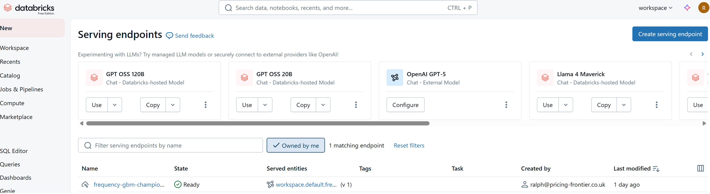

# 5.4. Deployment

Deploying machine learning models depends on the capabilities of your current infrastructure and the requirements of your pricing workflow. There are multiple approaches, each with trade-offs.

---

## Offline / Batch Scoring

Offline or batch scoring involves running models on datasets outside of a live system. This requires no immediate deployment and can simplify using ML in pricing, but it has some limitations:

- Good for generating classification files (e.g., postcode risk categories, vehicle classes).
- Can feed into offline optimisation frameworks to produce relativities or scorecards.
- Less responsive to changes in data; updates are only reflected when the batch is rerun.
- Useful when productionising is not yet feasible or for experimental analyses.

---

## PMML

Predictive Model Markup Language (PMML) is a standard for representing models that allows them to be imported into rating engines:

- Requires converting your ML model into a PMML file
- Often needs additional manipulation for compatibility with specific rating software
- Provides a way to deploy models where native code execution is not possible
- Limitations:
  - Specific library requirements for generating PMML
  - Deployment is often manual and brittle
  - Updates require repeating the conversion and deployment steps
  - Software can handle these inefficiently

---

## APIs

APIs (Application Programming Interfaces) provide a modern approach for live scoring and integration.

These involve hosting an endpoint that we can send a request to with features, and get a model prediction (and other data that might be of use) as a response. This means the API can be maintained indepently and when the underlying model is updated, the API is updated, and then any processes using the API will automatically be using the new model.

- Typical approach outside of insurance for real-time model use.
- Enables automated scoring and integration into pricing systems.
- Allows models to be part of a modular, end-to-end pricing system.
- Supports controlled deployment, with optional manual review before production use.
- Facilitates monitoring, version control, and rollback capabilities.
- Recommended for building flexible, scalable pricing infrastructure.

---

## Deploying model serving endpoint

Databricks Free edition can be used as a managed MLFlow service, which also includes model serving. 

[Documentation](https://docs.databricks.com/aws/en/mlflow/) for MLFlow on Databricks, until I create a guide.

A registered model can easily be turned to an endpoint with:

```python
from mlflow.deployments import get_deploy_client

client = get_deploy_client("databricks")

endpoint = client.create_endpoint(
    name="frequency-gbm-champion-endpoint",
    config={
        "served_entities": [
            {
                "name": "frequency-gbm-entity",
                "entity_name": "workspace.default.frequency_gbm",
                "entity_version": "1",  
                "workload_size": "Small",
                "scale_to_zero_enabled": True
            }
        ],
        "traffic_config": {
            "routes": [
                {
                    "served_model_name": "frequency-gbm-entity",
                    "traffic_percentage": 100
                }
            ]
        }
    }
)
```

---

This can then be viewed in the model serving section of Databricks:



---

This endpoint can then be called to return a list of predictions for each data point.

```python
import requests

payload = {"dataframe_split": {
    "index": df.index.tolist(),
    "columns": df.columns.tolist(),
    "data": df.values.tolist()
}}

response = requests.post(
    MODEL_VERSION_URI,
    headers={
        "Content-Type": "application/json"
    },
    auth=("token", DATABRICKS_TOKEN),
    data=json.dumps(payload))

response.json().get('predictions') # [0.3284297764608749]
```

## What this allows?

By creating an endpoint, the complexity of model training can be kept modular, within your pricing system.

Rating engines and any other processes can simply interact with the endpoint to get model scores. 

This allows models to be retrained, validated and deployed (automatically if desired), and any downstream processes do not need updating as the endpoint will remain the same, the responses will simply come from the new model.